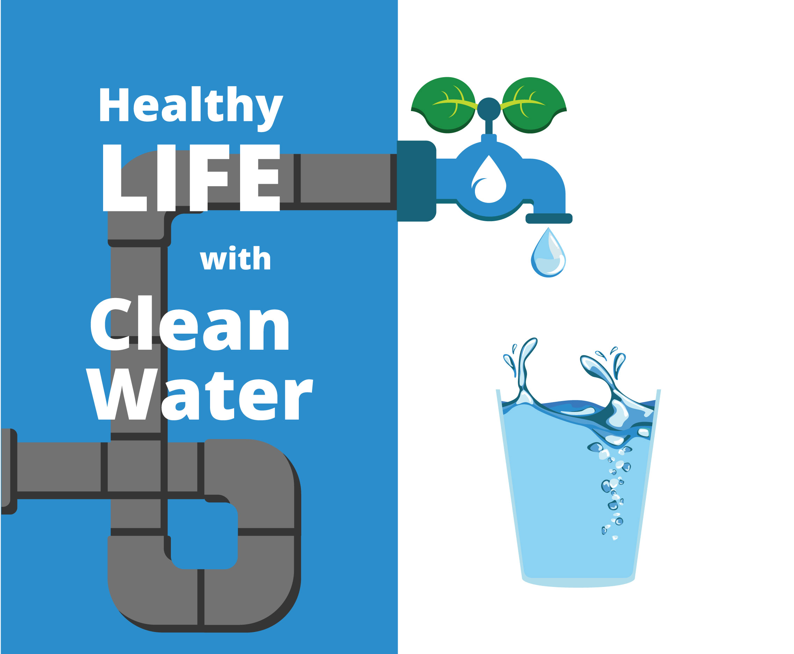

# MRAW
MRAW: Mortality Rates prediction based on Access to Water.

  

## What is MRAW?
MRAW is an acronym which stands for _Mortality Rates prediction based on Access to Water._ This is an experimental project where I built 4 ML models to predict mortality rates based on the access to clean drinking water in a country. 
The models make predictions for 4 rates: Children under five mortality rate, Adult above 15 mortality rate, Life expectancy at birth and Life expectancy at age 60. 

## Try it now!
Open [MRAW WebApp](https://bonam-m-mraw.hf.space) and get some predictions.

## How does it work?
The datasets used to train the 4 [XGBoost](https://xgboost.ai/about) models comes from the [WHO Global Health Observatory data repository](https://apps.who.int/gho/data/node.home). Check it out to learn more about how these rates are calculated.  

The datasets includes the percentage of people accessing clean drinking water and the mortality rates in all countries of the world, with entries from 2000 to 2020.

## What can you find in this repo?
Here is a description of the content of this repository.
To run locally, make sure to install the required packages: Python 3.11; Pandas; Numpy; Torch, XGBoost and all the other packages listed in the file _requirements.txt_

### Gradio app for easy interaction with the model
If you want to quickly interact with the model, locally, simply copy the python file (see _mraw_app.py_) and run it on your machine using VS Code or any other code editor.
You'll get a web interface supported by [Gradio](https://gradio.app/).  

Make sure to download the models files (see the _.model_ files under the _adult-mort-data_ and _child-mort-data_ folders) and update the path accordingly.

### Notebooks containing the data preparation and visualization scripts
In this repo, you will find the step by step process to clean the datasets and make them machine readable before using them to train the models (see _.ipynb_ files ending with _data-prep_). 
Make sure to install the required packages listed in the file _requirements.txt_

### Notebook containing the model training and evaluation scripts
Once the datasets were in good shape and appropriate format, the XGboost models were built and trained, then evaluated to see their performance (see _.ipynb_ files ending with _prediction_).
To run the Notebooks locally, mmake sure to install the required package: XGboost and all the other packages listed in the file _requirements.txt_

## What is the objective of MRAW?
MRAW is a prototype platform that shows the importance of accessing clean driking water by highlighting the correlation between access to drinking water and life expectancy for children and adults.

Stay tuned for upcoming updates!
